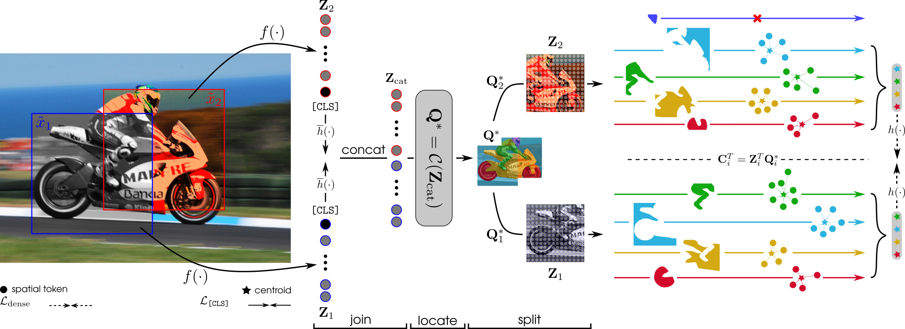

# CrOC
This repo contains the Pytorch implementation of our CVPR 2023 paper:
> [**CrOC: Cross-View Online Clustering for Dense Visual Representation Learning**](https://arxiv.org/pdf/2303.13245.pdf)
>
> [Thomas Stegmüller*](https://people.epfl.ch/thomas.stegmuller?lang=en), [Tim Lebailly*](https://www.timlebailly.com/), [Behzad Bozorgtabar](https://behzadbozorgtabar.com/), [Tinne Tuytelaars](https://homes.esat.kuleuven.be/~tuytelaa/), and [Jean-Philippe Thiran](https://people.epfl.ch/jean-philippe.thiran).




## Pretraining
### Single GPU pretraining
Run the [main_croc.py](main_croc.py) file. Command line args are defined in [parser.py](croc_utils/parser.py).
```bash
python main_croc.py --args1 val1
```

**Make sure to use the right arguments specified in the table below!**

### 1 node pretraining
```bash
python -m torch.distributed.launch --nproc_per_node=8 main_croc.py --args1 val1
```

## Citation
If you find our work useful, please consider citing:

```
@misc{stegmüller2023croc,
      title={CrOC: Cross-View Online Clustering for Dense Visual Representation Learning}, 
      author={Thomas Stegmüller and Tim Lebailly and Behzad Bozorgtabar and Tinne Tuytelaars and Jean-Philippe Thiran},
      year={2023},
      eprint={2303.13245},
      archivePrefix={arXiv},
      primaryClass={cs.CV}
}
```

## Pretrained models
You can download the full checkpoint which contains backbone and projection head weights for both student and teacher networks. We also provide detailed arguments to reproduce our results.

<table class="center">
  <tr>
    <th>pretraining dataset</th>
    <th>arch</th>
    <th>params</th>
    <th>batchsize</th>
    <th>LC PVOC12</th>
    <th>LC COCO things</th>
    <th>LC COCO stuff</th>
    <th colspan="2">download</th>
  </tr>

[//]: # (  <tr>)

[//]: # (    <th>COCO</th>)

[//]: # (    <td>ViT-S/16</td>)

[//]: # (    <td>21M</td>)

[//]: # (    <th>256</th>)

[//]: # (    <td>54.5%</td>)

[//]: # (    <td>55.6%</td>)

[//]: # (    <td>49.7%</td>)

[//]: # (    <td><a href="">full ckpt</a></td>)

[//]: # (    <td><a href="">args</a></td>)

[//]: # (  </tr>)

[//]: # (  <tr>)

[//]: # (    <th>COCO+</th>)

[//]: # (    <td>ViT-S/16</td>)

[//]: # (    <td>21M</td>)

[//]: # (    <th>256</th>)

[//]: # (    <td>60.6%</td>)

[//]: # (    <td>62.7%</td>)

[//]: # (    <td>51.7%</td>)

[//]: # (    <td><a href="">full ckpt</a></td>)

[//]: # (    <td><a href="">args</a></td>)

[//]: # (  </tr>)
  <tr>
    <th>ImageNet-1k</th>
    <td>ViT-S/16</td>
    <td>21M</td>
    <th>1024</th>
    <td>70.6%</td>
    <td>66.1%</td>
    <td>52.6%</td>
    <td><a href="https://rdr.kuleuven.be/api/access/datafile/28925">full ckpt</a></td>
    <td><a href="https://rdr.kuleuven.be/api/access/datafile/28924">args</a></td>
  </tr>
</table>


## Acknowledgments

This code is adapted from [DINO](https://github.com/facebookresearch/dino).
