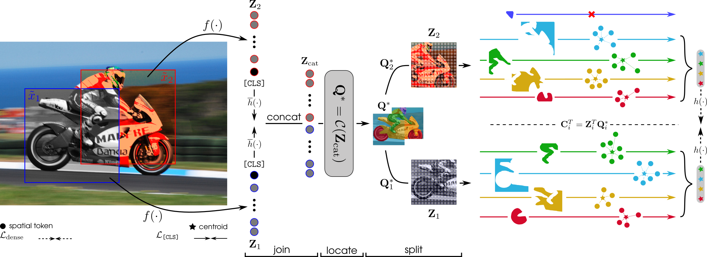

# CrOC
Code and link to paper coming soon!

## Pretrained models
You can download the full checkpoint which contains backbone and projection head weights for both student and teacher networks. We also provide detailed arguments to reproduce our results.

<table class="center">
  <tr>
    <th>pretraining dataset</th>
    <th>arch</th>
    <th>params</th>
    <th>batchsize</th>
    <th>LC PVOC12</th>
    <th>LC COCO things</th>
    <th>LC COCO stuff</th>
    <th colspan="2">download</th>
  </tr>
  <tr>
    <th>COCO</th>
    <td>ViT-S/16</td>
    <td>21M</td>
    <th>256</th>
    <td>54.5%</td>
    <td>55.6%</td>
    <td>49.7%</td>
    <td><a href="https://rdr.kuleuven.be/api/access/datafile/28866">full ckpt</a></td>
    <td><a href="https://rdr.kuleuven.be/api/access/datafile/28888">args</a></td>
  </tr>
  <tr>
    <th>COCO+</th>
    <td>ViT-S/16</td>
    <td>21M</td>
    <th>256</th>
    <td>60.6%</td>
    <td>62.7%</td>
    <td>51.7%</td>
    <td><a href="https://rdr.kuleuven.be/api/access/datafile/28865">full ckpt</a></td>
    <td><a href="https://rdr.kuleuven.be/api/access/datafile/28886">args</a></td>
  </tr>
  <tr>
    <th>ImageNet-1k</th>
    <td>ViT-S/16</td>
    <td>21M</td>
    <th>1024</th>
    <td>70.6%</td>
    <td>66.1%</td>
    <td>52.6%</td>
    <td><a href="https://rdr.kuleuven.be/api/access/datafile/28867">full ckpt</a></td>
    <td><a href="https://rdr.kuleuven.be/api/access/datafile/28887">args</a></td>
  </tr>
</table>